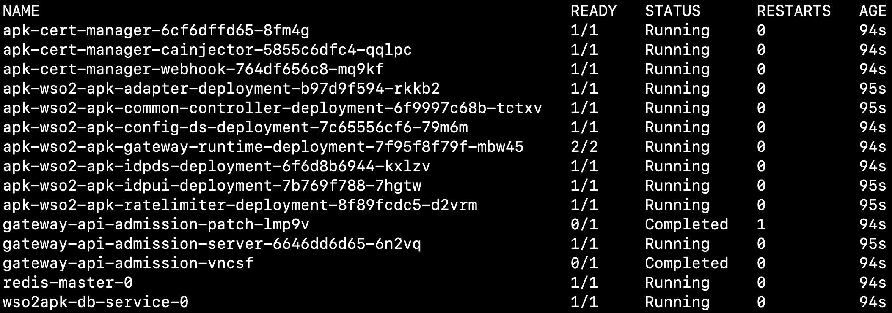

### Add Kubernetes Gateway Helm Repository

Adding the Kubernetes Gateway Helm repository allows your system to fetch and install the latest Kubernetes Gateway components from the remote repository. This ensures that you are always using the most up-to-date version of Kubernetes Gateway.

```console
helm repo add wso2apk https://github.com/wso2/apk/releases/download/1.3.0-rc

helm repo update
```

### Install Kubernetes Gateway Components

Next, install the Kubernetes Gateway components to set up the necessary infrastructure to manage and deploy APIs within your Kubernetes cluster.

Install the Kubernetes Gateway components and start the WSO2 API Platform For Kubernetes. Consider <b>apk</b> as the <b><chart-name\></b> for this guide. 
Use the version of the release you added in Step 1.

```
helm install apk wso2apk/apk-helm --version 1.3.0-rc -f https://raw.githubusercontent.com/wso2/apk/refs/heads/main/helm-charts/samples/apk/1.3.0-qsg-values.yaml
```

!!!Optional
    To commence the installation while making use of the customization capabilities inherent in the values.yaml file, follow the subsequent command format. Instructions in the [customize configurations section](../../setup/Customize-Configurations) will guide you through the process of acquiring the values.yaml file.
        
    === "Command"
        ```
        helm install apk wso2apk/apk-helm --version 1.3.0-rc -f values.yaml
        ```
    === "Format"
        ```
        helm install <chart-name> <repository-name>/apk-helm --version <version-of-APK> -f <path-to-values.yaml-file> 
        ```

!!!Optional
    If you want to update an existing Kubernetes Gateway installation, use the following Helm upgrade command. The --no-hooks flag disables the hooks available in the Kubernetes Gateway Helm chart)

    === "Command"
        ```
        helm install apk wso2apk/apk-helm --version 1.3.0-rc -f values.yaml --no-hooks
        ```
    === "Format"
        ```
        helm install <chart-name> <repository-name>/apk-helm --version <version-of-APK> -f <path-to-values.yaml-file> --no-hooks
        ```

### Verify the deployment

Verifying the deployment confirms that all Kubernetes Gateway components are successfully installed and running as expected. If any issues arise, troubleshooting them at this stage ensures a smooth API deployment process.
Check the status of deployed pods:

=== "Command"
    ```
    kubectl get pods
    ```

    [](../assets/img/get-started/podstatus.png)

    !!! Important
        Except for the `gateway-apim-admission` and `gateway-apim-admission-patch` (which will run as soon as Kubernetes Gateway is installed and then complete), all other pods should transition to the running state. If they have not, please refer the <a href="../../about-apk/FAQs/#4-why-are-pods-not-transitioning-to-the-running-state-for-a-long-time" target="_blank">FAQs</a> to troubleshoot the problem.

### Map API Hostnames to Your Local System

To ensure that your local machine correctly resolves API requests, you need to map the API hostnames to <b>127.0.0.1</b>. This is done by modifying your system's hosts file.

<b>For macOS/Linux</b>:

1. Open a terminal and run the following command to edit the hosts file:

    ```
    sudo nano /etc/hosts
    ```

2. Add the following lines at the end of the file:

    ```
    127.0.0.1   api.example.com
    127.0.0.1   idp.example.com
    127.0.0.1   default.gw.example.com
    ```

3. Save the file (CTRL + X, then Y, then Enter).

4. Flush the DNS cache (optional but recommended):

    ```
    sudo dscacheutil -flushcache  # macOS
    sudo systemctl restart nscd   # Linux (if using nscd)
    ```

<b>For Windows</b>:

1. Open Notepad as Administrator.
2. Navigate to C:\Windows\System32\drivers\etc\hosts.
   Add the following lines at the end of the file:

    ```
    127.0.0.1   api.example.com
    127.0.0.1   idp.example.com
    127.0.0.1   default.gw.example.com
    ```

3. Save the file and restart your computer (or run <b>ipconfig /flushdns</b> in Command Prompt to apply changes immediately).

!!! info "(Optional)  To access the deployment through your local machine:"
    To interact with the deployed API from your local machine, you need to expose the gateway service and route traffic appropriately.
    This involves identifying the external IP of the gateway service and setting up a port forward to access it locally.

    1. Identify the `gateway-service` external IP address.
        
        Find the external IP address assigned to the API gateway service, which allows external access to the deployed APIs.
        ```console
        kubectl get svc | grep gateway-service
        ```
    2. Port forward router service to localhost.
        
        If your cluster does not provide an external IP, you can use port forwarding to make the API gateway accessible from your local machine.
        ```console
        kubectl port-forward svc/apk-wso2-apk-gateway-service 9095:9095
        ```

